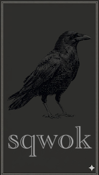

# sqwok

Group chat from the comfort of your terminal.



## Install

Download from our [Releases](https://github.com/ackertyson/sqwok/releases) page, or...

### Homebrew (macOS)

```shell
brew tap ackertyson/sqwok
brew install sqwok
```

To upgrade later:

```shell
brew update
brew upgrade sqwok
```

### Docker

Clone this repo locally, then:

```shell
docker compose build sqwok
docker compose run --rm sqwok join MY_INVITE_CODE

# once joined, you can later simply:
docker compose run --rm sqwok
```

Note that container file paths reported by the app may not map literally to your host paths.

### From source

Install [Rust](https://rust-lang.org/tools/install/), then...

```bash
cargo install --path .
```

## Onboarding

You'll need an invite code from someone, then you can do:

```shell
sqwok join MY_INVITE_CODE
```

On first launch the client walks you through registration:

1. Enter your email and screenname
2. Check your email and click the verification link
3. Scan the QR code with your authenticator app (Google Authenticator, Authy, etc.) and enter the 6-digit TOTP code _(you will need this same authenticator app if you ever need to recover your account later!)_
4. The client generates a keypair and gets a cert signed by the server's CA

Credentials are stored in `~/.sqwok/identity/`

*NOTE: You are encouraged to configure your OS to use a time server — clock drift is a common source of registration failure.*

## Keyboard setup

Mac users may need to configure your terminal to treat `option` key as `Alt`. ITerm2 may work best if you set your option key(s) to send `Esc+`

## Why sqwok?

There are tons of online chat apps out there. sqwok makes some unique design choices in an attempt to distinguish itself:

1. **replies go in threads**: you can't select a message to quote/reply, but you can start threads (up to 2 levels deep)
2. **one group per session**: encourages longer, focused interactions
3. **panes reduce scrolling**: split the window into panes for independent views of the chat, useful for following multiple "hot" threads
4. **prioritizes live coversations**: local-only message storage means at least some peers have to be online at the same time (see How Messages Work below)
5. **quiet `@mentions`**: no pings, no dings, just a different "unread" highlight color and an extra asterisk on the "X new" element

Also, it's a shell terminal app. Points for nerdiness.

## Account Recovery

If you lose your device (or delete `~/.sqwok/identity/`) and need to re-register:

1. Run `sqwok` and enter your original email at the prompt
2. Click the verification link in your email
3. Enter the 6-digit TOTP code from your **existing** authenticator app entry — **do not re-scan a QR code**, that would break your account (the QR code only shows in this flow so it can't be used to sniff whether an account already exists for a given email)
4. The client generates a new keypair; the server issues a new cert with your original UUID and disconnects any old sessions

When you rejoin a chat, other online members will automatically sync you the message history they have and re-distribute encryption keys for your new device. How much history you recover depends on what your peers still have locally — messages that have fallen off every peer's device are gone for good.

**If you lose access to your authenticator app**, account recovery is not possible without contacting the server administrator.

## How Messages Work

sqwok is designed so the server never decodes or stores your messages. When you send a message, the server assigns it a sequence number and relays it to everyone who's currently online — but it doesn't keep a copy. Your chat history lives entirely on your device.

If you send a message and nobody else in the chat is online, it's stored only on your machine until another member comes online. When that happens, your client automatically shares the messages they missed — no action required on either side. If multiple people are online, the work of catching up a returning member is split across them.

This means your local chat database is the authoritative record of your conversations. If you lose your device, your message history is only recoverable from other members' devices when they're online and still have those messages.

Encryption keys are the one exception: when a group's keys rotate while someone is offline, the server holds onto the new keys (not the messages) for up to 30 days so that person can still decrypt everything once they reconnect.

## Security Model

sqwok is **secure but not anonymous**. The server cannot read message content — that's guaranteed by the encryption. What it can see is metadata: who is in a group, who sent each message, and when. If your threat model is "I don't want the server operator reading our conversations," sqwok delivers on that. If your threat model is "I don't want anyone to know we're talking," it doesn't.

Also, Claude wrote this with my inexpert guidance, so it might not even work. Any crypto nerds want to take a shot at it?

## Chat Navigation

| Key | Action |
|---|---|
| `↑` / `↓` | Move selection between messages |
| `→` | Expand a collapsed thread |
| `←` | Collapse an expanded thread |
| `Enter` | Focus a message's thread input; send from an active input |
| `Alt+←` / `Alt+→` | Switch pane focus |
| `Alt+m` | Jump to next `@mention` |
| `Alt+n` | Jump to next unread message |
| `/` | Open command bar |
| `Alt+\` | Split pane vertically |
| `Alt+-` | Split pane horizontally |
| `Alt+w` | Close the current pane |
| `Tab` | Cycle command bar suggestions |
| `Esc` | Dismiss command bar or modal |

Max thread depth is 2 (message → reply → sub-reply).

## Command Bar

Press `/` to open the command bar. Use it to switch chats, search users, manage members, create invite codes, access settings, and manage blocked users.

## Blocking Users

Type `/block` (or `/bl`) to open the block manager. The top section lets you search for peers to block; the bottom section lists currently blocked users you can unblock. If you have a message selected when you open the command, the sender is pre-filled in the search.

Blocking is local-only — it hides the peer's messages and threads from your view without notifying anyone. Blocked users are also excluded from the member list, peer counts, and `@mention` autocomplete.

## Invite Codes

Generate an invite from the command bar or member list modal and share it out-of-band. Codes have a TTL (1h / 24h / 7d) and optional single-use enforcement.

## Acknowledgements

The code was written by Claude, the product design is mine.
